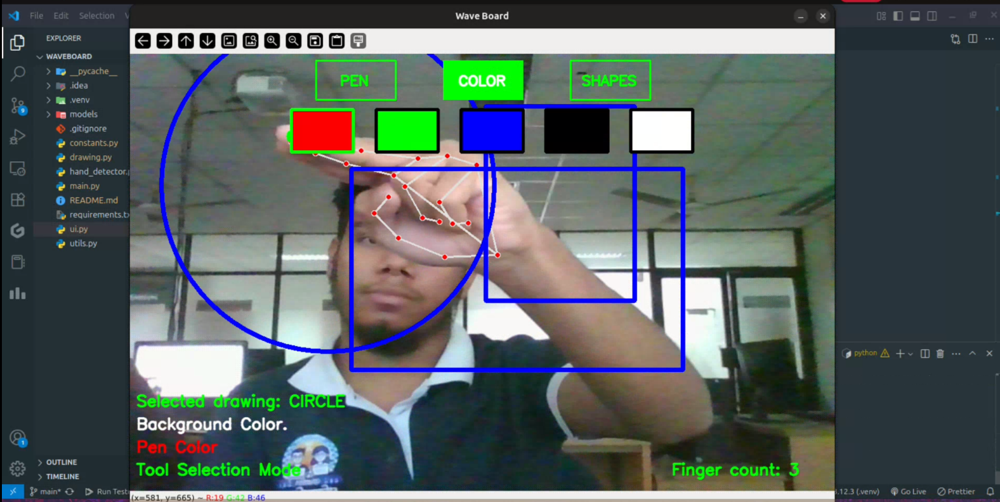

# 🖐️ WaveDraw

**WaveDraw** is a computer vision-based drawing application powered by **MediaPipe** and **OpenCV**, allowing users to draw using **hand gestures** — no mouse or touchscreen needed! It supports multiple drawing tools like pen, line, rectangle, and circle, along with dynamic color selection.

---

## 🎯 Features
- ✋ **Gesture-based drawing** using webcam and hand tracking
- 🖌️ **Drawing Tools**:
    - Pen (freehand drawing)
    - Line
    - Rectangle
    - Circle
- 🎨 **Color selection** via gesture-controlled palette
- 🧼 **Clear screen** with a thumbs-down gesture
- ✊ **Finger counting** (display how many fingers are raised)
- 👋 **Current gesture display** (e.g., pinching, thumbs up, etc.)

---

## 📸 Demo

## 📸 Demo

### 🖼️ Screenshot



### ▶️ Watch the Video

▶️ [Click here to watch the demo video](demo.mp4)

> Click the thumbnail or link to play the video.


## 🛠️ Technologies Used

- Python (3.8+)
- [OpenCV](https://opencv.org/) – for camera input and rendering
- [MediaPipe](https://mediapipe.dev/) – for hand landmark detection

---


## 🚀 How to Run

### 1. Clone the repository

```bash
git clone https://github.com/your-username/WaveDraw.git
cd WaveDraw
```

### 2. Install dependencies

Create and Activate virtual environemt:
```bash
python3 -m venv .venv
source .venv/bin/activate
```

Using pip:

```bash
pip install -r requirements.txt
```

Or install manually:

```bash
pip install opencv-python mediapipe numpy
```
### 3. Run the app

```bash
python main.py
```

## 🖱️ Controls (via Gestures)
 * Index finger is drawing mode
 * Double finger is selection mode


## Impromvements to do next:

- 🧠 Add gesture to undo/clear
- 💾 Export image to file
- 🖌️ Add brush thickness selector
- 🧤 Left-hand support